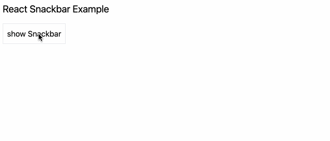

# react-snackbar-example

The example of Snackbar UI component in React.



## Environments

- Node.js v20.11.0
- React 19
- tailwindcss 3.4.1
- Storybook 8.4

- Visual Studio Code(Dev Containers)

## Usage

```bash
react-snackbar-example$ npm run dev
Debugger attached.

> react-snackbar-example@0.0.0 dev
> vite --host 0.0.0.0

Debugger attached.

  VITE v5.2.4  ready in 144 ms

  ➜  Local:   http://localhost:5173/
  ➜  Network: http://172.17.0.2:5173/
  ➜  press h + enter to show help
```

To run Storybook.

```bash
react-snackbar-example$ npm run storybook
Debugger attached.

> react-snackbar-example@0.0.0 storybook
> storybook dev -p 6006 --no-open

Debugger attached.
@storybook/core v8.4.7
```

## Demo

https://codesandbox.io/p/github/toms74209200/react-snackbar-example/master

## License

[MIT License](LICENSE)

## Author

[toms74209200](<https://github.com/toms74209200>)